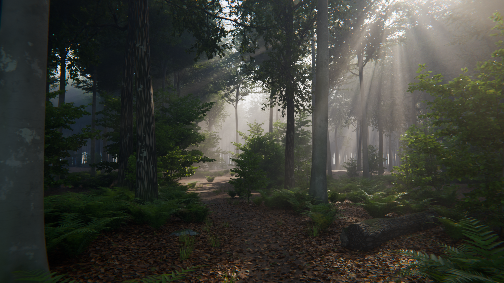

# Procedural photorealistic forest — Blender + Cycles



*2560 × 1440 (1440p), Cycles, 48 samples + OpenImageDenoise, rendered with
`python forest_scene.py --preset final`. There is no retouching outside Blender.*

One Python file builds the whole scene. It downloads no textures, HDRIs or models and
needs no add-ons: every mesh and material is generated by code.

## What's in the scene

- **Terrain**: about 600 × 435 m of gently rolling forest floor with a worn footpath. The
  grid is dense near the camera and coarse far away.
- **Trees**: procedural beech and oak. Each has a trunk with root flare and buttresses,
  buried surface roots, dead stubs, and limbs that branch down to twigs, carrying 45k–290k
  individual leaf meshes per tree. Young beech saplings form the understory. About 2,350
  instanced trees fill the whole view cone, so the forest never visibly ends.
- **Ground cover**: ferns with arching fronds and lobed pinnae, grass tufts along the path,
  about 55k leaf-litter leaves, fallen twigs, mossy boulders and a fallen log.
- **Materials** (all procedural):
  - smooth beech bark with lichen, algae streaks and basal moss
  - furrowed oak bark
  - translucent leaves with veins and per-leaf colour variation
  - forest floor, mossy rock, and weathered deadwood with bare patches
- **Light and lens**:
  - physical sky with a low, warm sun
  - volumetric haze for the light shafts
  - AgX tone mapping
  - a compositor finish: bloom, a hint of chromatic aberration, and a vignette
  - a 26 mm lens at f/4 with depth of field

## Requirements

- Blender **4.2 or newer**. Tested with 4.5 LTS and 5.0. Alternatively, use the `bpy`
  module (`pip install bpy`, Python 3.11).
- About **9 GB of free RAM** for the `final` preset. Draft and preview need less.

## Usage

**Blender GUI:** go to the *Scripting* workspace, choose *Text › Open…*, open
`forest_scene.py`, and press *Run Script*. The forest is built into a new scene called
**Forest** in about a minute. Press **F12** to render.

**Command line:**

```bash
# the 1440p image above
blender -b -P forest_scene.py -- --preset final --render forest_1440p.png

# quick look (960x540)
blender -b -P forest_scene.py -- --preset draft --render draft.png

# just build and save the .blend
blender -b -P forest_scene.py -- --save forest.blend
```

**Without a Blender install** (the PyPI `bpy` module):

```bash
pip install bpy
python forest_scene.py --preset final --render forest_1440p.png
```

| option | meaning |
|---|---|
| `--preset draft\|preview\|final` | resolution, samples and scatter density (see below) |
| `--res WxH`, `--samples N` | override the preset |
| `--gpu` | render on the GPU (OptiX, CUDA, HIP, Metal or oneAPI) |
| `--seed N` | a different forest layout (default 7) |
| `--season autumn` | autumn foliage and litter colours |
| `--no-fog` | skip the volumetric haze (much faster, loses the light shafts) |
| `--render PATH` | render a still. A `.exr` path writes linear HDR |
| `--save PATH` | save the generated `.blend` |
| `--threads N` | limit the CPU render threads |

| preset | resolution | samples | scatter density |
|---|---|---|---|
| `draft` | 960 × 540 | 32 | 45 % |
| `preview` | 1280 × 720 | 48 | 100 % |
| `final` | 2560 × 1440 (1440p) | 48 | 100 % |

The `final` image above took **26 minutes** on a 4-core Xeon CPU with no GPU, including about
1 minute of scene generation. `draft` and `preview` are proportionally quicker. A GPU
(`--gpu`) should be much faster, but I couldn't measure one here. For a cleaner image, raise
`--samples`; the time scales about linearly.

## Tweaking

All the art direction lives at the top of `forest_scene.py`:

- `LOOK`: camera position, lens, aperture, focus, sun azimuth/elevation/strength/colour,
  sky fill, fog density and anisotropy, exposure, and the AgX look.
- `PATH_POINTS`: the course of the footpath.
- `SPECIES`: tree architecture (height, crown base, branching angles and densities,
  leaves per metre, leaf size).
- `PRESETS`: resolution, samples and density per preset.

## Things to know

- **Scattering follows the camera.** Leaf litter, ferns, grass, twigs, rocks and saplings
  are only generated inside the camera's view cone, which keeps memory reasonable. If you
  move the camera in Blender, you'll find bare ground outside the original view. To reframe,
  change `LOOK` and re-run the script.
- **The viewport shows a subset of the instances.** It displays only 10–50% of them (a
  Geometry Nodes *Is Viewport* switch) to stay interactive. Renders always get everything.
- **It's procedural, not photoscanned.** The scene holds up at the framing it was built
  for. Extreme close-ups of bark or leaves still look CG. The next step up in realism
  would be scanned textures and plants (e.g. Poly Haven or Megascans), which this
  environment couldn't download.
- **Volumetrics dominate the render time.** `--no-fog` is the quickest way to iterate on
  layout.
